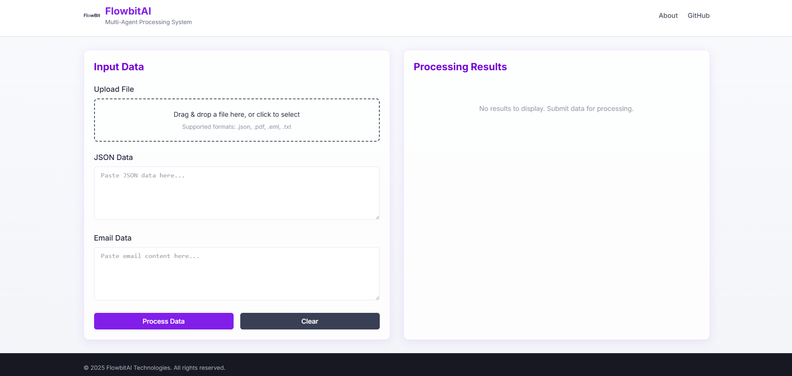
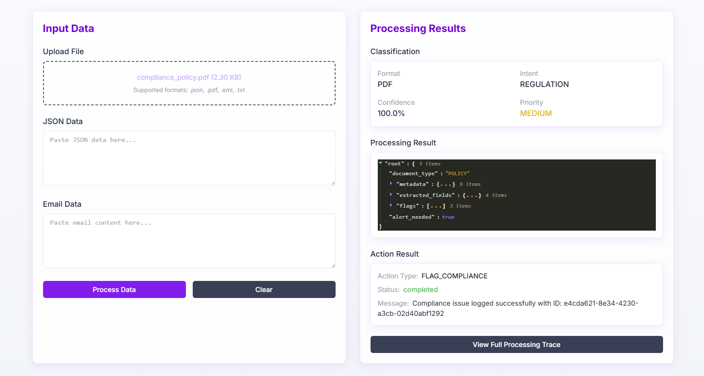
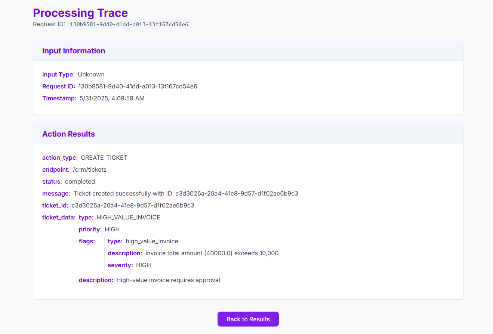

# FlowbitAI Multi-Agent Processing System


A sophisticated multi-agent system that processes diverse input formats (Email, JSON, PDF), classifies business intent, and executes contextual follow-up actions through intelligent agent orchestration.

## 🎯 Project Overview

This system demonstrates advanced multi-agent AI architecture with autonomous decision-making capabilities. It's designed to:

1. Process inputs from multiple formats (Email, JSON, PDF)
2. Classify both format and business intent with confidence scoring
3. Route to specialized agents based on classification results
4. Extract structured information from unstructured content
5. Detect anomalies, fraud risks, and compliance issues
6. Dynamically chain follow-up actions based on content analysis
7. Maintain a complete audit trail through a shared memory store

## System Architecture

```
┌─────────────────┐    ┌──────────────────┐    ┌──────────────────┐
│   API Gateway   │────│    Classifier    │────│   Format Agents  │
│   (FastAPI)     │    │      Agent       │    │ (Email/JSON/PDF) │
└─────────────────┘    └──────────────────┘    └──────────────────┘
        │                       │                      │
        │                       ▼                      │
        │             ┌───────────────────┐            │
        └─────────────│    Memory Store   │────────────┘
                      │  (Redis+SQLite)   │
                      └───────────────────┘
                                │
                                ▼
                      ┌───────────────────┐
                      │   Action Router   │
                      │  & Orchestrator   │
                      └───────────────────┘
                                │
                                ▼
                      ┌───────────────────┐
                      │   External APIs   │
                      │   (Simulated)     │
                      └───────────────────┘
```

## Components

### 1. Classifier Agent
- Detects format and business intent
- Maps to Format: JSON, Email, PDF
- Maps to Intent: RFQ, Complaint, Invoice, Regulation, Fraud Risk
- Uses few-shot examples + schema matching
- Passes routing + intent metadata to memory

### 2. Email Agent
- Extracts structured fields: sender, urgency, issue/request
- Identifies tone (e.g., escalation, polite, threatening)
- Triggers action based on tone + urgency
  - Escalate → notify CRM (simulate with API)
  - Routine → log and close

### 3. JSON Agent
- Parses webhook data
- Validates required schema fields
- Flags anomalies (e.g., field mismatch, type errors)
- If anomalies detected → log alert in memory/API

### 4. PDF Agent
- Extracts fields from PDF documents
- Parses line-item invoice data or policy document
- Flags if:
  - Invoice total > 10,000
  - Policy mentions "GDPR", "FDA", etc.

### 5. Shared Memory Store
- All agents read/write to shared memory
- Stores:
  - Input metadata (source, timestamp, classification)
  - Extracted fields per agent
  - Chained actions triggered
  - Agent decision traces

### 6. Action Router
- Based on agent outputs, triggers follow-up action
- e.g., Create ticket, escalate issue, flag compliance risk
- Simulates via REST call (e.g., POST /crm, POST /risk_alert)

## 🚀 Setup and Installation

### Backend Setup

1. Clone the repository
```bash
git clone https://github.com/pranaysathish/flowbit-multipurpose-agent.git
cd flowbit-multipurpose-agent
```

2. Create a virtual environment and install dependencies
```bash
python -m venv venv
source venv/bin/activate  # On Windows: venv\Scripts\activate
pip install -r requirements.txt
```

3. Run the backend application
```bash
python run.py
# Or alternatively: uvicorn app.main:app --reload --host 0.0.0.0 --port 8000
```

The backend API will be available at http://localhost:8000

### Frontend Setup

1. Navigate to the UI directory
```bash
cd ui
```

2. Install dependencies
```bash
npm install
```

3. Run the development server
```bash
npm run dev
```

The frontend application will be available at http://localhost:3000

## 📊 Demo and Usage

### Video Demo
A comprehensive video demonstration of the system is available [here](https://youtu.be/your-demo-video-link).

### Sample Inputs
The repository includes sample inputs for testing:

- **Email Samples**: `samples/emails/`
  - Regular inquiry email
  - Complaint with urgent tone
  - Security alert with fraud indicators

- **JSON Samples**: `samples/json/`
  - Standard webhook data
  - Transaction with anomalies
  - Fraud risk alert

- **PDF Samples**: `samples/pdfs/`
  - Invoice with line items
  - Policy document with regulatory terms
  - High-value transaction report

### Using the Application

1. Open the web interface at http://localhost:3000
2. Upload a file or paste JSON/Email content in the appropriate input field
3. Click "Process Data" to start the multi-agent analysis
4. View the classification results, agent processing details, and triggered actions
5. Explore the full processing trace to see the complete decision flow

### API Documentation

Access the interactive API documentation:
```
http://localhost:8000/docs
```

## 🔍 Key Features and Technical Implementation

### Advanced Classification System
- **Multi-dimensional classification**: Format + Intent + Priority
- **Confidence scoring**: Measures certainty of classification decisions
- **Keyword-based intent detection**: Uses extensive keyword libraries for each intent type
- **Priority determination**: Assigns HIGH/MEDIUM/LOW based on content analysis

### Specialized Agent Processing
- **Email Agent**: Extracts structured fields, analyzes tone (POLITE, URGENT, THREATENING) and urgency
- **JSON Agent**: Validates against schema templates, detects anomalies and suspicious patterns
- **PDF Agent**: Extracts text and structured data, identifies compliance terms and financial thresholds

### Shared Memory Architecture
- **Central data repository**: Maintains complete processing context
- **Chronological tracing**: Records every step of the processing pipeline
- **Cross-agent communication**: Enables complex decision chains
- **Complete audit trail**: Captures all decisions and their reasoning

### Intelligent Action Routing
- **Context-aware decisions**: Actions determined by combining all agent outputs
- **Simulated API integration**: Demonstrates external system integration
- **Detailed action reasoning**: Explains why each action was chosen

### Modern User Interface
- **Next.js + Tailwind CSS**: Responsive, modern design
- **Real-time processing visualization**: Shows each step of the processing pipeline
- **Interactive results display**: Detailed view of classification, processing, and actions
- **Full trace exploration**: Access to complete processing history

## 📋 Project Highlights

### Technical Stack
- **Backend**: Python, FastAPI, SQLite, PyPDF2, email parsing libraries
- **Frontend**: Next.js, React, Tailwind CSS, Framer Motion
- **Architecture**: Multi-agent system with shared memory store

### Completed Bonus Challenges
- ✅ **User Interface**: Built a modern, responsive UI for data upload and visualization
- ✅ **Error Handling**: Implemented comprehensive error handling throughout the system
- ✅ **Processing Visualization**: Added real-time processing step visualization

### Future Enhancements
- 🔄 **Retry Logic**: Add automatic retry for failed agent actions
- 🐳 **Dockerization**: Package the entire application for easy deployment
- 🧠 **Machine Learning**: Integrate ML models for improved classification accuracy

## 📊 Screenshots

### Main Interface


### Processing Results


### Full Trace View


## 👨‍💻 About the Developer

This project was developed by Pranay J Sathish as part of the FlowbitAI Agent Development Internship assessment.

Connect with me:
- [GitHub](https://github.com/pranaysathish)
- [LinkedIn](https://www.linkedin.com/in/pranay-j-sathish/)

## Usage

1. Send a request to the API with your input data (Email, JSON, or PDF)
2. The system will classify the input, process it with the appropriate agent
3. Based on the extracted information, it will trigger the necessary actions
4. All processing steps and actions are logged in the memory store

## Sample Inputs

Sample inputs for testing are available in the `samples` directory:
- Email samples
- JSON webhook samples
- PDF invoice and policy samples

## License

This project is created for educational purposes as part of the Flowbit AI Agent Development Internship assessment.
